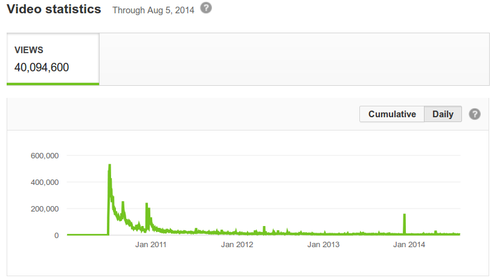

A YouTube video history metadata crawler (ytcrawl)
========================================

Author: Honglin Yu
Email: yuhonglin1986@gmail.com


About
-----
*ytcrawl* is a YouTube video viewcount (can also crawl subscribers/shares/watchtimes when available) history crawler. During middle 2013, YouTube has published videos' history daily viewcount (when uploaders make it public, see the image below). These can be precious data for computational social science research. This crawler aims to help researchers efficiently download the data.




Basic functionalities
---------------------
1. There are two ways to use the crawler: ```single_crawl``` and  ```batch_crawl```.
2. When using ```batch_crawl```, due to the limitation of YouTube's server, it can access about 36,000 videos per hour (would meet lots of "quota exceeded" error when faster). The actual number of downloaded viewcounts depends on how many videos' data are public (more than 60% in former experiments). 
3. It fully logs the crawling status. Easy to continue crawling from breakpoint.
4. Optionally, it can send you email to report "errors" or "job finished".


Usage
-----
The following example shows how to crawl the history viewcount of video "WoUsHkdb12A"
1. Put the code somewhere, add its folder to python library path and then import ```Crawler```, for example,
```python
import sys
sys.path.append('/path/to/ytcrawl')
from crawler import Crawler
```
2. Create an crawler object
```python
c = Crawler()
```
The configuration of this object is explained in below
3. Begin to crawl,
```python
c.single_crawl("OQSNhk5ICTI")  # crawl a single video by ID "OQSNhk5ICTI"
c.batch_crawl("/path/to/videoID/file", "/output/path") # crawl all the videos in a file. Output the crawled data and log files input an output folder.
```

Input/Output Format
-------------------

* For ```batch_crawl```
  - Input videoID file: every line in the input file is a videoID
  - Output Folder:
     - ```data``` folder : contains the xml response from YouTube using "hash folder structure". One can extract the information after crawling.
     - ```key.done``` : videos whose information is crawled
     - ```key.disabled``` : videos whose information is not public (can not crawl)
     - ```key.invalidrequest``` : If you receive lots of error here, please report it on Github
     - ```key.nostatyet``` : no statistics for the video: often because the video is newly uploaded
     - ```key.quotalimit``` : the speed is too fast, exceed YouTube's quota. These videos can be crawled again in next run.
     - ```key.private``` : the video is a private video (can not crawl)
     - ```key.notfound``` : the videoID is wrong or the video has disappeared from YouTube
* For ```single_crawl```
  - Input : a videoID
  - Output : a dictionary containing all the possible information crawled

Configuration
-------------


Continue from Breakpoint
------------------------
Just rerun the crawler with same parameters, it can automatically jump over the videos which are already crawled.

Optional: Email Reminder
------------------------


LICENSE
--------
BSD 3 clause

